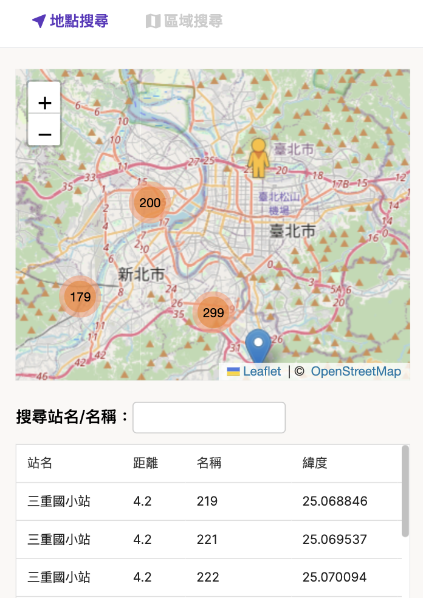
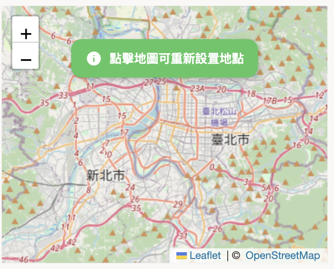
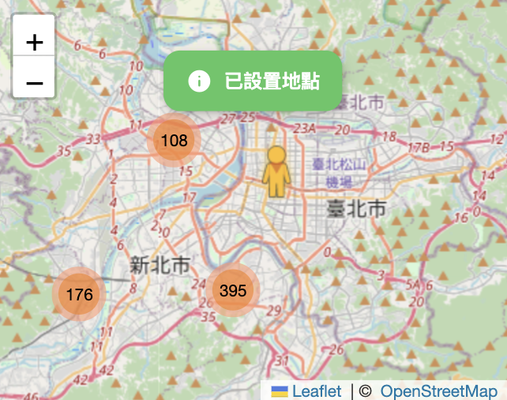
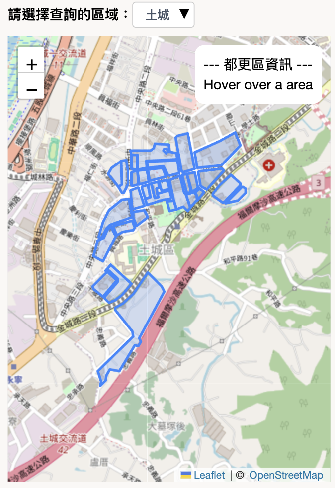
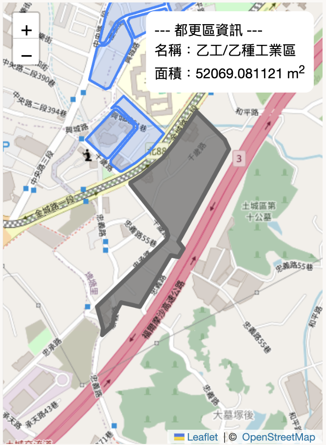

# Interactive Maps
都市更新查詢地圖，可查詢附近都更地點或是都更區域

使用 Vue 3 開發，搭配 `leaflet.js` 以及 `vue3-easy-data-table` 製作


## 開發說明
### 安裝 Package
使用 `node v20.10.0`，可安裝 `nvm` 切換版本

```sh
# 安裝 package
npm install
```

### 本機開發
```sh
# 啟動本機 Server
npm run dev
```

若需使用本機 mock data
```sh
# 啟動 json server
npm run mock

# 修改 API_ENDPOINT.js
API_ENDPOINT = "http://localhost:3002/";
```
可自行於 `mock/db.json` 調整資料內容

### 部署
目前專案部署至 GitHub Pages，採用 `GitHub Actions` 部署流程。當 push 至 main 分支時，會觸發 GitHub Actions 執行 `static.yml` 中的內容。

<!-- ## 使用說明
使用者必須先登入 Google 帳號，再連結 Facebook 帳號，才可開始使用

＊目前應用程式沒有可使用的驗證商家，故先提供**略過選項**，以便使用查詢地圖

> [!NOTE]
> Facebook 應用程式若要取得一般用戶資料，必須有**進階存取權限**且為**上線模式**
>
> Meta 2023/02/02 說明，開發人員需要進行**商家驗證**，才能取得進階存取權限 -->

### 地點搜尋
**使用所在位置查詢附近都更點，若無法取得位置，將使用預設值。**

- 成功抓取資料後，會呈現在地圖及列表中
  

- 重新設定所在位置
  - 地圖任一處點擊，可移除使用者圖標
  

  - 再選擇新地點，點擊後增加使用者圖標，並重新計算附近都更點距離
  

### 區域搜尋
**選擇新北市行政區，可顯示該行政區都更區資訊** (*目前僅提供土城區*)

- 該行政區所有都更區域
  

- Hover/點擊區域，會於右上方顯示資訊
  


### 其他
- 點擊`連結 Facebook` 按鈕時，若出現 Alert 提醒，可能是 Facebook SDK 未成功載入造成，請確認是否有安裝廣告阻擋套件，可嘗試關閉套件或是略過此連結帳號步驟。

- 輸入 Facebook 帳戶資訊進行登入後，若出現**無法使用此功能：因為我們正在更新這個應用程式的其他細節，所以這個應用程式目前無法使用 Facebook 登入，請稍後再試**的訊息，係因該用戶不在應用程式的角色清單中，可在 Alert 中點擊`略過`按鈕或是回到連結社群帳號頁面點擊`略過此步驟`。

## 參考資料

[開發人員平台現在需要商家驗證才能取得進階存取權限](https://developers.facebook.com/blog/post/2023/02/01/developer-platform-requiring-business-verification-for-advanced-access/)

[商家驗證](https://developers.facebook.com/docs/development/release/business-verification/)
