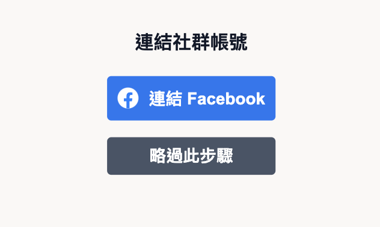

# oakmega-task
新北市都市更新地圖 Demo

https://pengpon.github.io/oakmega-task/#/login

## 使用說明
使用者必須先登入 Google 帳號，再連結 Facebook 帳號，才可開始使用。




＊目前應用程式沒有可使用的驗證商家，故先提供**略過選項**，以便使用查詢地圖。


補充：
- Facebook 應用程式若要取得一般用戶資料，必須有`進階存取權限`且為`上線模式`。
- Meta 2023/02/02 說明，開發人員需要進行**商家驗證**，才能取得`進階存取權限`，[資料來源](https://developers.facebook.com/blog/post/2023/02/01/developer-platform-requiring-business-verification-for-advanced-access/)。

### 地點搜尋
**使用所在位置查詢附近都更點，若無法取得位置，將使用預設值。**

- 成功抓取資料後，會呈現在上方地圖及下方列表中
  

- 重設所在位置
  - 地圖任一處點擊，移除使用者圖標
  

  - 再選擇新地點，點擊後會增加使用者圖標，並重新計算附近都更點距離
  

### 區域搜尋
**選擇新北市行政區，可顯示該行政區都更區資訊** (＊目前僅提供土城區)

- 該行政區所有都更區域
  

- Hover/點擊區域，會於右上方顯示資訊
  

## 開發說明

### 安裝 Package
使用 `node v20.10.0`，可安裝 `nvm` 切換版本

```sh
# 安裝 package
npm install
```

### 本機開發
```sh
# 啟動本機 Server
npm run dev
```

若需使用本機 mock data
```sh
# 啟動 json server
npm run mock

# 修改 API_ENDPOINT.js
API_ENDPOINT = "http://localhost:3002/";
```
**可自行於 `mock/db.json` 調整資料內容**

### 部署
目前專案部署至 GitHub Pages，採用 `GitHub Actions` 部署流程。當 push 至 main 分支時，會觸發 GitHub Actions 執行 `static.yml` 中的內容。

